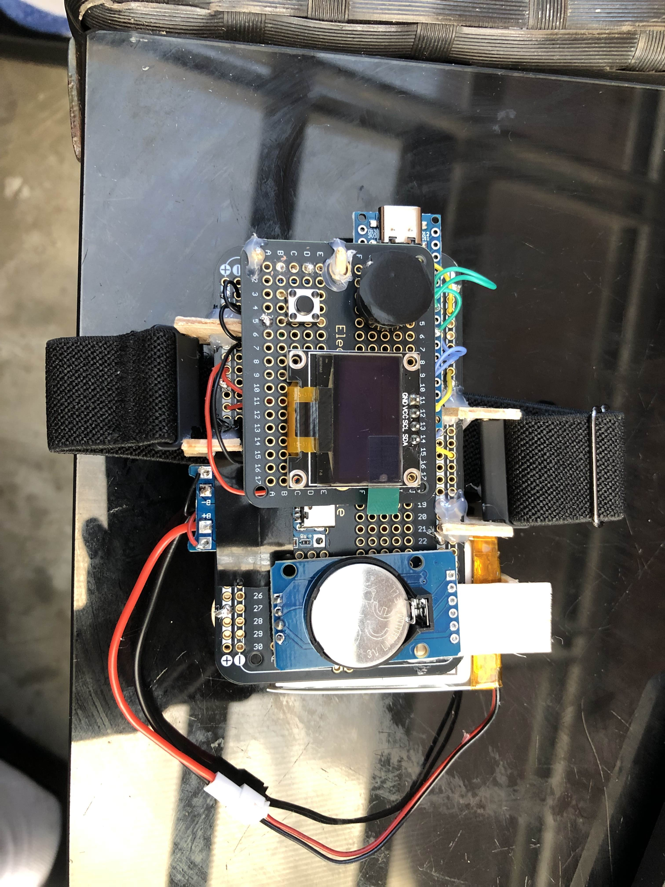
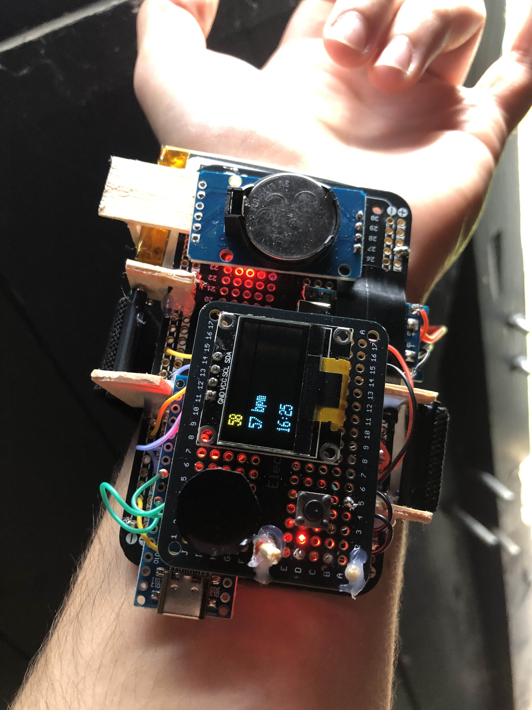
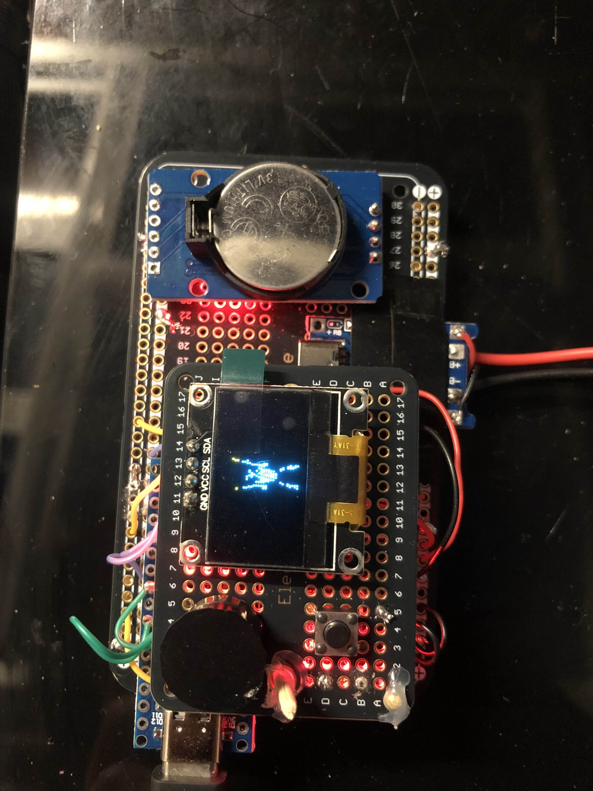

# Arduino-Watch

## Parts list
- 129 * 64 OLED LCD Display
- **Solderable** PCB Breadboard
- TP4056 Charging Module (Type C)
- 3.7V 1100mAH Lithium Battery
- Arduino Nano
- JST Female Connector
- Voltage Booster Module
- Schottky Rectifier Diode
- MAX30102 Heart Rate Sensor
- GY-521 MPU-6050 Accelerometer
- RTC Module
- Passive Buzzer
- Button
- Wrist Watch Strap of Choice

## You will need
- Solder Wire and Iron
- 30 AWG Wire
- Computer with Arduino IDE
- Hot Glue Gun

## You may want
- Multimeter for Testing
- Rework Station

## Features

